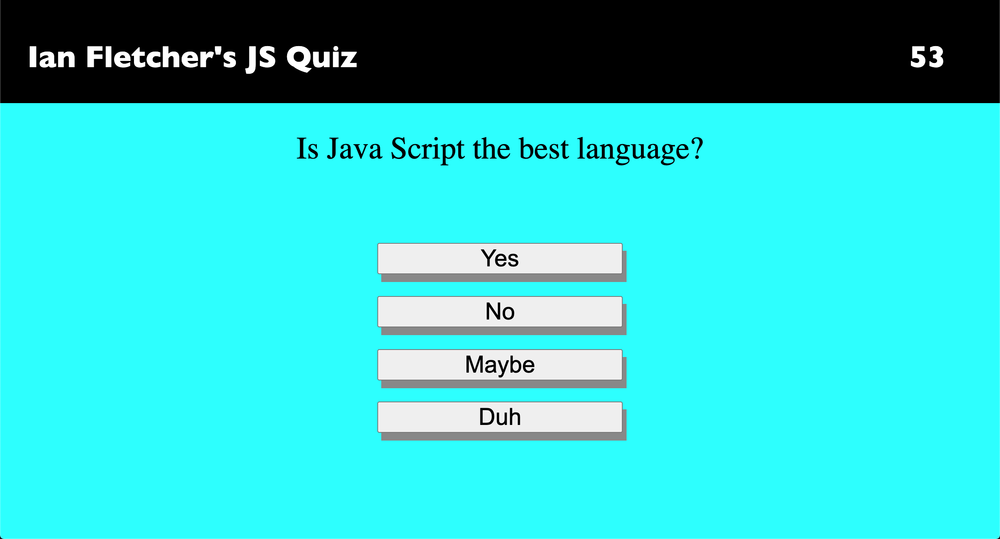
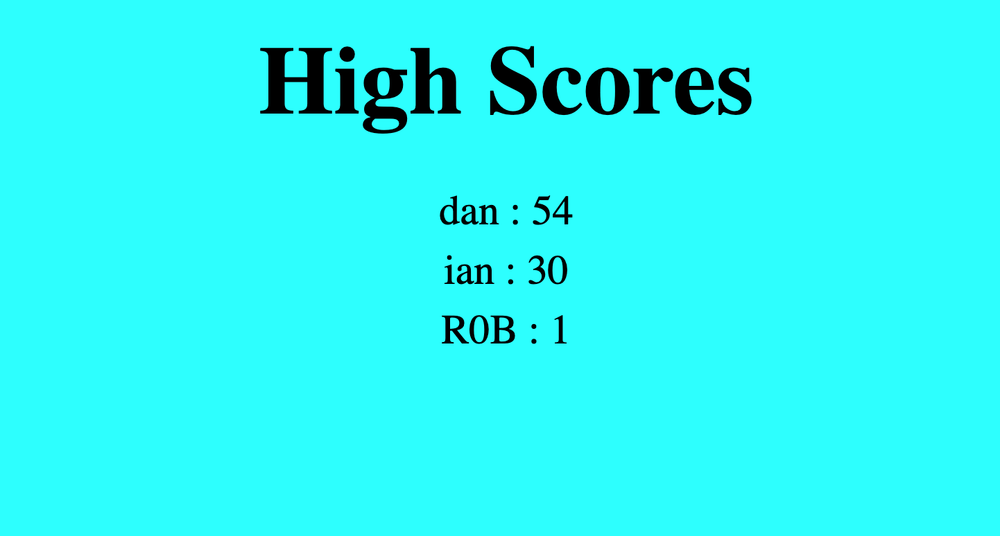

# JS Quiz

## The Repository 
This Repository is where Ian Fletcher's Java Script Quiz is housed. 

## Installation
In order to acess and refractor the code you must first go through the Installation Process.

1) Open GitHub and navigate to the main repository 

2) Click the green "Code" button Above the top right corner of the files 

3) To clone the repository using HTTPS, under "Clone with HTTPS", click the clipboard icon. To clone the repository using an SSH key, including a certificate issued by your organization's SSH certificate authority, click "Use SSH", then click the clipboard icon. To clone a repository using GitHub CLI, click "Use GitHub CLI", then click the clipboard icon.

4) Open Terminal and navigate to the directory where you want the repository to be 

5) Type "git clone ", and then paste the SSH, CLI, or HTTPS link you coppied on GitHub and press ENTER 

This should put a copy of the repository into the directory you had chosen in step 1

## Usage
This application should allow users to take a simple Java Script quiz. The quiz has a 60 second timer that begins when the user starts. If the user get an answer wrong 10 seconds are deducted from the timer. If the user finishes all of the questions or the timer hits 0 seconds, they are able to record their score (score = the amount of seconds remaining when the quiz is finished). When the quiz is over the user is able to record their score and initials into a high score leader board which is linked at the end. Have Fun :)
## Languages and Technologies Used
HTML  
CSS  
Java Script  

[Check Out The Full Page](https://ianfletcher314.github.io/JSquiz/)

## Credits

- [GitHub's Document on Cloning Repositories (used in Instalation section)](https://docs.github.com/en/github/creating-cloning-and-archiving-repositories/cloning-a-repository) 
- [VS Code's ReadMe Page (used for formating and licensing syntax)](https://github.com/microsoft/vscode/blob/master/README.md)

## License 

Copyright (c) Horision SSS Inc. All Rights Reserved.

Licensed under the [MIT](license.txt) license
